# TJNovel 数据库设计（ER 图）

> 根据后端 25 个 `@Entity` 实体还原，共 4 个库（userdb / contentdb / transactiondb / admindb），
> 微服务之间为**逻辑关联**（应用层维护），未建物理外键。完整建表语句见 `mysql.sql`。

```mermaid
erDiagram
    READER {
        bigint READER_ID PK
        varchar READER_NAME
        varchar PASSWORD
        decimal BALANCE
        datetime CREATE_TIME
    }
    AUTHOR {
        bigint AUTHOR_ID PK
        varchar AUTHOR_NAME
        decimal EARNING
    }
    MANAGER {
        bigint MANAGER_ID PK
        varchar MANAGER_NAME
    }
    RECENT_READINGS {
        bigint READER_ID PK "FK->READER"
        bigint NOVEL_ID PK "FK->NOVEL"
        bigint CHAPTER_ID
        datetime RECENT_READING_TIME
    }
    NOVEL {
        bigint NOVEL_ID PK
        bigint AUTHOR_ID "FK->AUTHOR"
        varchar NOVEL_NAME
        varchar STATUS
        bigint TOTAL_WORD_COUNT
    }
    CHAPTER {
        bigint NOVEL_ID PK "FK->NOVEL"
        bigint CHAPTER_ID PK
        varchar TITLE
        longtext CONTENT
        bigint WORD_COUNT
        varchar IS_CHARGED
    }
    CATEGORY {
        varchar CATEGORY_NAME PK
    }
    NOVEL_CATEGORY {
        bigint NOVEL_ID PK "FK->NOVEL"
        varchar CATEGORY_NAME PK "FK->CATEGORY"
    }
    COMMENTS {
        bigint COMMENT_ID PK
        bigint READER_ID "FK->READER"
        bigint NOVEL_ID "FK->NOVEL"
        bigint CHAPTER_ID "FK->CHAPTER"
        int LIKES
    }
    COMMENT_REPLY {
        bigint COMMENT_ID PK "FK->COMMENTS"
        bigint PRE_COM_ID
        int COMMENT_LEVEL
    }
    COLLECT {
        bigint NOVEL_ID PK "FK->NOVEL"
        bigint READER_ID PK "FK->READER"
    }
    LIKES {
        bigint COMMENT_ID PK "FK->COMMENTS"
        bigint READER_ID PK "FK->READER"
    }
    RECOMMEND {
        bigint NOVEL_ID PK "FK->NOVEL"
        bigint READER_ID PK "FK->READER"
    }
    rate {
        bigint novel_id PK "FK->NOVEL"
        bigint reader_id PK "FK->READER"
        decimal score
    }
    REPORT {
        bigint REPORT_ID PK
        bigint READER_ID "FK->READER"
        bigint COMMENT_ID "FK->COMMENTS"
    }
    WHOLEPURCHASE {
        bigint READER_ID PK "FK->READER"
        bigint NOVEL_ID PK "FK->NOVEL"
        varchar IS_BOUGHT
    }
    TRANSACTION {
        bigint TRANSACTION_ID PK
        bigint READER_ID "FK->READER"
        varchar TRANS_TYPE
        decimal AMOUNT
    }
    REWARD {
        bigint TRANSACTION_ID PK "FK->TRANSACTION"
        bigint NOVEL_ID "FK->NOVEL"
    }
    PURCHASE {
        bigint TRANSACTION_ID PK "FK->TRANSACTION"
        bigint CHAPTER_ID "FK->CHAPTER"
        bigint NOVEL_ID "FK->NOVEL"
    }
    AUTHOR_INCOME {
        bigint ID PK
        bigint AUTHOR_ID "FK->AUTHOR"
        varchar TYPE
        decimal AMOUNT
        bigint NOVEL_ID "FK->NOVEL"
    }
    MANAGEMENT {
        bigint MANAGEMENT_ID PK
        bigint MANAGER_ID "FK->MANAGER"
    }
    NOVEL_MANAGEMENT {
        bigint MANAGEMENT_ID PK "FK->MANAGEMENT"
        bigint NOVEL_ID "FK->NOVEL"
    }
    CHAPTER_MANAGEMENT {
        bigint MANAGEMENT_ID PK "FK->MANAGEMENT"
        bigint NOVEL_ID "FK->NOVEL"
        bigint CHAPTER_ID "FK->CHAPTER"
    }
    COMMENT_MANAGEMENT {
        bigint MANAGEMENT_ID PK "FK->MANAGEMENT"
        bigint COMMENT_ID "FK->COMMENTS"
    }
    REPORT_MANAGEMENT {
        bigint MANAGEMENT_ID PK "FK->MANAGEMENT"
        bigint REPORT_ID "FK->REPORT"
    }

    READER ||--o{ RECENT_READINGS : "最近阅读"
    READER ||--o{ COMMENTS : "发表"
    READER ||--o{ COLLECT : "收藏"
    READER ||--o{ LIKES : "点赞"
    READER ||--o{ RECOMMEND : "推荐"
    READER ||--o{ rate : "评分"
    READER ||--o{ WHOLEPURCHASE : "整本购"
    READER ||--o{ REPORT : "举报"
    READER ||--o{ TRANSACTION : "交易"
    AUTHOR ||--o{ NOVEL : "创作"
    NOVEL ||--o{ CHAPTER : "含章节"
    NOVEL ||--o{ NOVEL_CATEGORY : "分类"
    CATEGORY ||--o{ NOVEL_CATEGORY : "归类"
    NOVEL ||--o{ COMMENTS : "被评"
    NOVEL ||--o{ COLLECT : "被藏"
    NOVEL ||--o{ RECOMMEND : "被推"
    NOVEL ||--o{ rate : "被评"
    NOVEL ||--o{ WHOLEPURCHASE : "被购"
    NOVEL ||--o{ AUTHOR_INCOME : "产生收益"
    CHAPTER ||--o{ COMMENTS : "被评"
    CHAPTER ||--o{ REPORT : "被举报"
    COMMENTS ||--o{ LIKES : "获赞"
    COMMENTS ||--o{ COMMENT_REPLY : "有回复"
    COMMENTS ||--o{ REPORT : "被举报"
    TRANSACTION ||--o| REWARD : "打赏明细"
    TRANSACTION ||--o| PURCHASE : "购买明细"
    AUTHOR ||--o{ AUTHOR_INCOME : "收入"
    MANAGER ||--o{ MANAGEMENT : "操作"
    MANAGEMENT ||--o| NOVEL_MANAGEMENT : "管小说"
    MANAGEMENT ||--o| CHAPTER_MANAGEMENT : "管章节"
    MANAGEMENT ||--o| COMMENT_MANAGEMENT : "管评论"
    MANAGEMENT ||--o| REPORT_MANAGEMENT : "管举报"
```

## 分库说明

| 库 | 服务 | 表 |
|---|---|---|
| userdb | user-service | READER, AUTHOR, MANAGER, RECENT_READINGS |
| contentdb | content-service | NOVEL, CHAPTER, CATEGORY, NOVEL_CATEGORY, COMMENTS, COMMENT_REPLY, COLLECT, LIKES, RECOMMEND, rate, REPORT, WHOLEPURCHASE |
| transactiondb | transaction-service | TRANSACTION, REWARD, PURCHASE, AUTHOR_INCOME |
| admindb | admin-service | MANAGEMENT, NOVEL_MANAGEMENT, CHAPTER_MANAGEMENT, COMMENT_MANAGEMENT, REPORT_MANAGEMENT |

## 设计要点（面试可讲）

1. **按服务分库**：4 个微服务各持独立库，无跨库事务，边界清晰（典型的数据库per-service）。
2. **大文本分离**：`CHAPTER.CONTENT` 用 `LONGTEXT`，`COMMENTS.CONTENT` / `NOVEL.INTRODUCTION` 用 `TEXT`，靠 InnoDB 行溢出，不影响短列查询；字数 `WORD_COUNT` 冗余，避免扫正文。
3. **计数冗余字段**：`RECOMMEND_COUNT` / `COLLECTED_COUNT` / `LIKES` / `TOTAL_PRICE` 等冗余存储，排行榜/列表直接读，不实时聚合。
4. **复合主键**：`CHAPTER(NOVEL_ID, CHAPTER_ID)`、`COLLECT`、`LIKES`、`RECOMMEND`、`rate`、`NOVEL_CATEGORY` 等用业务复合键，避免自增 id 跨小说冲突。
5. **一对一明细表**：`REWARD` / `PURCHASE` 用 `TRANSACTION_ID` 做主键与 `TRANSACTION` 一对一，避免单表列膨胀。
6. **逻辑外键**：跨库关联（如 READER→NOVEL、TRANSACTION→NOVEL）在应用层维护，未建物理外键，契合微服务解耦。
